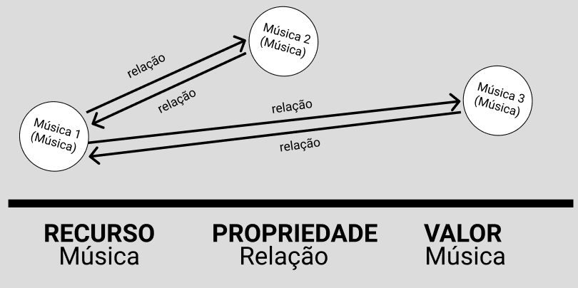
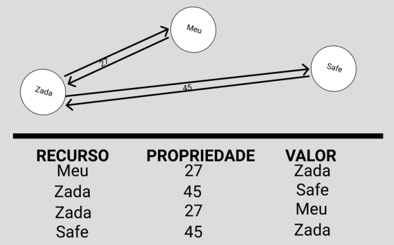

# Modelo para Apresentação do Lab09 - Grafo de Conhecimento

Estrutura de pastas:

~~~
├── README.md  <- arquivo apresentando a tarefa
│
└── images     <- arquivos de imagem usados na tarefa
~~~

# Aluno
* `223382`: `Pedro Henrique Rodrigues de Araújo`

## Exemplo de Grafo de Conhecimento - para publicar ou enriquecer
> Utilize a abordagem (recurso, propriedade, valor) para apresentar seu grafo exemplo.
> Coloque a imagem do PNG do seu modelo lógico como ilustrado abaixo (a imagem estará na pasta `image).
>
> Você pode usar um grafo ilustrando as classes, como este:
> 
>
> Além de outro com exemplo de instâncias, como este:
> 

A representação na forma de triplas é opcional.

## Perguntas de Pesquisa ou Queries

> Liste aqui as três perguntas de pesquisa ou queries
> * Quais 2 músicas possuem a maior peso entre si?
> * Que gêneros são mais semelhantes entre si?
> * Qual é o grau de semelhança entre 2 músicas X e Y?
